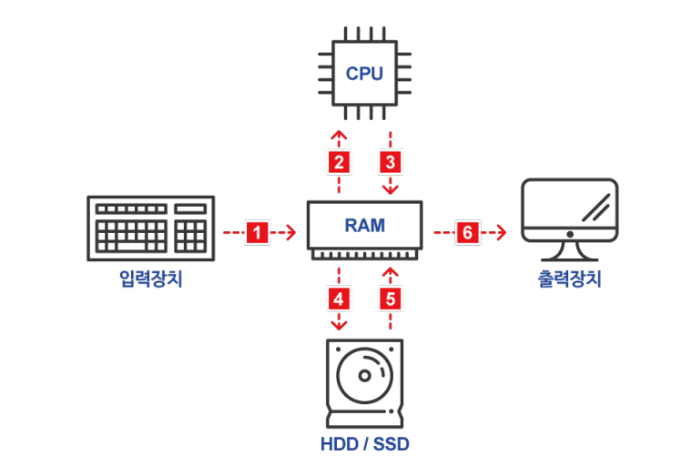

# Topic01 하드웨어

## 핵심 키워드 
- 하드웨어
- 중앙처리장치
- 기억장치
- 입출력장치


이미지 출처 : edwith Cs50 하드웨어

## 하드웨어란 ?
- 컴퓨터를 물리적으로 구성하는 요소
- 컴퓨터나 컴퓨터의 주변에 붙어있는 구성 요소들
- 중앙처리장치, 기억장치, 입출력장치 로 구성되어 있다

### 중앙처리장치(CPU)
- 프로세스라고 불리기도 한다.
- 입력장치에서 받은 명령을 실제로 처리한다.
- 1초에 얼마나 많은 연산을 할 수 있는지에 대한 단위는 기가헤르츠(GHz) 

### 기억장치
- 입력된 명령이나 데이터가 저장되는 공간
- 주기억장치, 보조기억장치로 나뉜다.
- ```주기억장치``` 중 하나인 ```RAM 은 기억된 정보를 읽어내기도 하고 다른 정보를 기억시킬 수 있는 메모리```로서, 응용 프로그램을 일시적으로 불러오거나, 데이터를 일시적으로 저장하는데 사용되는 임의 접근 기억 장치이다. 단위는 기가바이트(GB)가 사용된다.
- 주기억장치 RAM 이 일시적으로 데이터를 저장하는 것에 반해 ```하드드라이브(C:)는 영구적으로 데이터를 저장```한다. 이것을 ```보조기억장치```라고 한다.
- 하드디스크(Hard Disk Drive, HDD)는 원판 모양의 플래터를 회전시켜 드라이브에 데이터를 읽고 쓰는 원리이다.
- 그 외 SSD(Solid State Drive)라는 보조기억장치가 있는데, 하드디스크와 달리 움직이는 부품 없이 더 빠른 속도로 데이터를 읽고 쓰는 대신 가격은 더 비싸다.
- USB 플래시 드라이브는 이동식 저장공간 기기로  SSD와 마찬가지로 움직이는 부품이 없다. 
- 이러한 저장용 드라이브 외에도 광학 디스크 드라이브라는 것이 있는데 컴퓨터가 CD나 DVD를 읽고 쓸 수 있다. 

### 입출력장치
- 입력장치와 출력장치를 통틀어 입출력장치라고 한다.
- 입력장치는 사용자가 입력한 자료를 컴퓨터가 이해할 수 있는 형태로 변환하는 장치 이며, 대표적으로 키보드, 마우스 등이 있다.
- 대표적인 출력장치는 모니터와 프린터 등이 있다.

---

### 느낌
- 읽고 쓴다라는 말을 리눅스나 프로그래밍에서는 저장하고 수정하고 볼 수 있다 라는 뜻이다.
- 예전 수업시간에 배웠던 내용을 복습하는 기분이었다.

### 생각해보기 
Q. 어떻게 USB는 지금처럼 보편화 될 수 있었을까요? 애플이나 다른 회사는 이 표준 포트 사용을 피하고 싶어할까요?

A. USB가 보편화 되기 전에는 키보드, 마우스 여타 다른 기기들 별로 포트가 따로 있었을 테고 이는 사용자나 제품을 개발하는 사람, 컴퓨터를 설계 / 개발하는 사람들 모두에게 불편했을 것이다. 자신의 컴퓨터에 맞는 포트를 찾아야하고 사용할 수 있는 기기는 한정적이었을 것이다. 이러한 점들은 불편으로 다가왔을 테고. 이에 대기업에서 USB 포트만 적용할 수 있는 컴퓨터를 출시하면서 USB가 보편화 되었다고 생각한다.

애플이나 다른 회사는 표준포트 사용을 피할 이유가 없다고 생각한다. 따라서, 애플이 usb-c 타입으로 충전 형태를 바꾼 것도 최근에는 C-C 방식을 채용하는 것도 표준 포트를 따라가기 위해서가 아닐까?


Q. SSD가 아닌 HDD를 사용해야하는 이유에는 어떤것들이 있을까요?

A. SSD는 움직이는 부품이 없어 HDD보다 더 빨리 데이터를 읽고, 쓰고, 액세스할 수 있다. HDD는 일반적으로 SSD보다 가격이 저렴했고 더 큰 용량을 제공한다. 하지만 HDD는 움직이는 부품, 진동 및 높은 온도의 단점이 있다. 이런 특성들로 보았을때 HDD는 비용면을 고려해야하고 더 많은 데이터를 저장해야할 때 사용할 것 같다. 

---
기타 참고 자료 : [USB 이야기](https://m.blog.naver.com/prnbada7/221215493534), [SSD HDD](https://www.westerndigital.com/ko-kr/solutions/ssd-vs-hdd), [하드웨어, 소프트웨어, 운영체제](http://mwultong.blogspot.com/2005/12/hardware-software-os.html)
